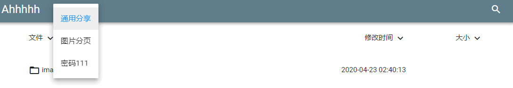
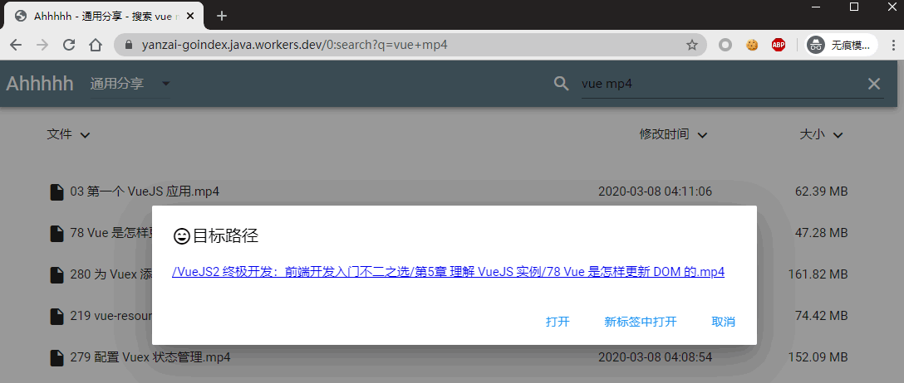
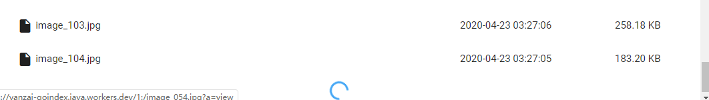

  

GoIndex  
====  

这是一个 [修改版的goindex](https://github.com/yanzai/goindex) ，在 [原版goindex](https://github.com/donwa/goindex) 基础上添加了多盘支持、搜索、分页加载等功能。

`index.js` 包含 Workers 所需的代码.

## 预览

Demo: https://yanzai-goindex.java.workers.dev

多盘：  

搜索：  

分页：  

## 更新日志

### 2020-4-28

- 添加 Basic Auth 认证，每个盘符可单独配置用户名和密码，可以保护该盘下所有子文件和子文件夹

- 支持自定义 web 界面主题色，添加了 dark_mode ; 在 `uiConfig` 中可以配置

- 原 goindex 的 .password 验证方式作为后备验证方式得以保留，但默认不开启

  以上，详见 `index.js` 中的配置项的注释。

### 2020-4-23

- 支持调用 nPlayer / MXPlayer Free / MXPlayer Pro / PotPlayer / VLC 播放，支持直接复制直链
- 简单支持 PDF 文件预览
- 可以配置是否允许其他 web 前端 cors 方式获取文件

### 2020-3-9

- flac file play support

### 2020-3-7

- 添加搜索功能，搜索结果分页增量展示，并支持跳转到对应路径浏览
- 搜索功能支持个人盘和团队盘全盘搜索
- 搜索分页大小可配置，具体见 `index.js` 注释
- 尝试解决移动端滚动到底部时的增量加载问题
- UI优化，盘符选择改为下拉框展示

### 2020-3-5

- 文件列表页分页增量加载，支持自定义分页大小，多页内容的可以缓存，配置见 `index.js` 注释
- 图片浏览页 下一张/上一张 导航
- 优化列目录时的速度

### 2020-3-4

在原版基础上修改：

- 添加多盘支持，自主设置要显示的多盘及各自密码
- 前端只修改了 material ，故不支持 classic 主题
- 配置见 `index.js` 注释
  

---

> **安装部署可以参考原版，以下摘自原版 goindex 的部署说明：**

## Demo  
material:  
[https://index.gd.workers.dev/](https://index.gd.workers.dev/)  
classic:  
[https://indexc.gd.workers.dev/](https://indexc.gd.workers.dev/)  

## 安装部署方案1  
1、在本地安装 rclone   
2、按照 https://rclone.org/drive/ 流程进行授权。  
3、执行 rclone config file 查看 rclone.conf 路径。找到root_folder_id和refresh_token记录下来。  
4、下载 https://github.com/donwa/goindex 中的 index.js  并填入 root 和 refresh_token  
5、复制代码 到 CloudFlare 部署。  

## 安装部署方案2  
作者不会记录refresh_token，但为避免纠纷，建议有条件的同学使用方案1进行部署  
1、访问[https://install.gd.workers.dev/](https://install.gd.workers.dev/)  
2、授权认证后，生成部署代码。  
3、复制代码 到 CloudFlare 部署。  

## 文件夹密码：
在google drive 文件中放置 `.password` 文件来设置密码。  
密码文件只能保护该文件不被列举，不能保护该文件夹的子文件夹不被列举。  
也不保护文件夹下文件不被下载。  

程序文件中 `root_pass` 只为根目录密码，优先于 `.password` 文件  

## 更新日志  

1.0.6  
添加 classic 模板  

1.0.5  
添加文件展示页  

1.0.4  
修复 注入问题。  

1.0.3  
修复 `.password` 绕过下载问题。  

1.0.2  
优化前端逻辑  
添加文件预览功能(临时)  
添加前端文件缓存功能  

1.0.1  
添加 README.md 、 HEAD.md 支持  

1.0.0  
前后端分离，确定基本架构  
添加.password 支持  
